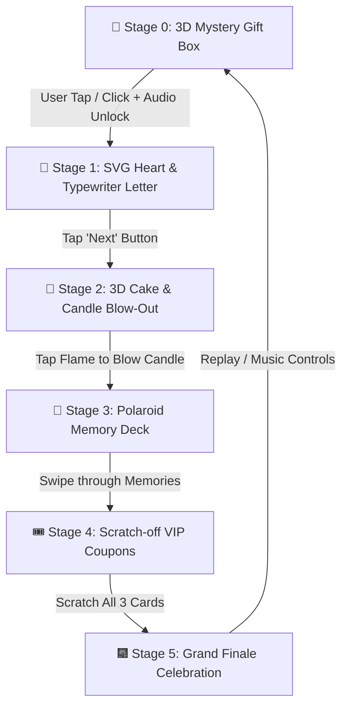

<div align="center">

# ✨ Happy Birthday Interactive Celebration ✨
### *An Immersive, Multi-Stage 3D Web Greeting Experience*

[](https://github.com/saklincodes/HappyBirthday/stargazers)
[](https://github.com/saklincodes/HappyBirthday/network/members)
[](LICENSE)
[](https://github.com/saklincodes/HappyBirthday)

[](https://developer.mozilla.org/en-US/docs/Web/HTML)
[](https://developer.mozilla.org/en-US/docs/Web/CSS)
[](https://developer.mozilla.org/en-US/docs/Web/JavaScript)
[](https://www.npmjs.com/package/canvas-confetti)
[](https://animejs.com/)

[**Live Demo**](https://saklincodes.github.io/HappyBirthday/) • [**Report Bug**](https://github.com/saklincodes/HappyBirthday/issues) • [**Request Feature**](https://github.com/saklincodes/HappyBirthday/issues)

---

</div>

## 📖 Table of Contents

- [🌟 Overview](#-overview)
- [✨ Key Features](#-key-features)
- [🗺️ Interactive Flow & Architecture](#️-interactive-flow--architecture)
- [📸 Experience Stages Breakdown](#-experience-stages-breakdown)
  - [1. Mystery 3D Gift Box Entrance](#1-mystery-3d-gift-box-entrance)
  - [2. SVG Heart & Typewriter Letter](#2-svg-heart--typewriter-letter)
  - [3. 3D Birthday Cake & Blowable Candle](#3-3d-birthday-cake--blowable-candle)
  - [4. Polaroid Memory Showcase Carousel](#4-polaroid-memory-showcase-carousel)
  - [5. Scratch-off VIP Birthday Vouchers](#5-scratch-off-vip-birthday-vouchers)
  - [6. Grand Finale & Audio Atmosphere](#6-grand-finale--audio-atmosphere)
- [📂 Project Structure](#-project-structure)
- [🚀 Quick Start & Installation](#-quick-start--installation)
- [🌐 Deployment (GitHub Pages)](#-deployment-github-pages)
- [🛠️ Customization Guide](#️-customization-guide)
  - [Modify Greeting Texts](#1-modify-greeting-texts)
  - [Update Photo Memories](#2-update-photo-memories)
  - [Customize Scratch Vouchers & Promises](#3-customize-scratch-vouchers--promises)
  - [Change Background Music](#4-change-background-music)
- [⚡ Performance & Mobile Optimizations](#-performance--mobile-optimizations)
- [🤝 Contributing](#-contributing)
- [📄 License](#-license)
- [💖 Acknowledgments & Author](#-acknowledgments--author)

---

## 🌟 Overview

**Happy Birthday Interactive Web Experience** transforms a traditional birthday greeting into an unforgettable, gamified visual adventure. Engineered with pure modern web technologies, fluid 60 FPS CSS animations, particle physics, and responsive glassmorphism aesthetics, it runs seamlessly across desktop, tablet, and mobile browsers with zero dependencies or build steps required.

> Built with love to create unforgettable birthday memories for your special person! 💖🎂

---

## ✨ Key Features

- 🎁 **Interactive 3D Gift Box**: Pulsing 3D gift box with ambient heartbeat glow and smooth lid opening animation.
- 💌 **Mathematical SVG Heart & Typewriter**: Real-time parametric Bézier curve drawing paired with a human-cadence emotional typewriter letter.
- 🎂 **Interactive Candle Blow-out**: Click or tap the candle flame to blow it out with realistic smoke dissipation and celebration toasts.
- 📸 **Polaroid Memory Deck**: Stacked vintage Polaroid cards with washi tape details, smooth physics transitions, and custom captions.
- 🎟️ **Scratch & Reveal Coupons**: Gamified birthday vouchers with custom reveal interactions.
- 🎈 **Full-Sky Atmospheric Physics**: 5-zone balanced floating balloons and gentle falling rose petals dynamically populating the scene.
- 🎆 **Particle Confetti Explosions**: Multi-colored celebration bursts timed to user interactions.
- 🎵 **Audio Engine**: Smart audio controller with seamless background music play upon first interaction.
- 📱 **100% Mobile & Touch Optimized**: Anti-zoom gesture locks and responsive touch targets for a native app feel.

---

## 🗺️ Interactive Flow & Architecture



---

## 📸 Experience Stages Breakdown

### 1. Mystery 3D Gift Box Entrance
- **Visuals**: Pulsing 3D gift box with synchronized ambient heartbeat glow.
- **Audio Initialization**: Seamlessly bypasses modern browser autoplay restrictions by unlocking celebration audio on first user gesture.
- **Transition**: Smooth vertical lid ejection with CSS transforms.

### 2. SVG Heart & Typewriter Letter
- **Mathematical Curve**: Real-time Bézier curve stroke drawing enclosing heartfelt messages.
- **Typewriter Engine**: Punctuation-aware typing speed with realistic pauses for emotional warmth.
- **Sparkle Dust**: Dynamic ambient dust particles floating around the scene.

### 3. 3D Birthday Cake & Blowable Candle
- **High-Definition Cake**: Custom celebration cake rendering.
- **Interactive Flame**: Animated glowing flame with natural flickering physics.
- **Blow-Out Mechanic**: Click or tap the candle to blow it out, triggering realistic smoke dissipation and celebration toasts.

### 4. Polaroid Memory Showcase Carousel
- **Vintage Polaroid Styling**: Realistic photo frames with textured washi tape accents.
- **Smooth Navigation**: Interactive swipe/tap controls with indicators.
- **Custom Captions**: Personalized memory notes with hashtags.

### 5. Scratch-off VIP Birthday Vouchers
- **Interactive Reveal**: Tap/click to scratch off mystery cards.
- **Customizable Rewards**: Tailored rewards (e.g., *VIP Birthday Wish*, *Lifetime Promise*, *Unlimited Pampering Pass*).
- **Milestone Trigger**: Automatically unlocks the Grand Finale once all cards are revealed.

### 6. Grand Finale & Audio Atmosphere
- **5-Zone Balloon Spawner**: Guarantees evenly distributed floating balloons across the entire viewport.
- **Confetti Cannon Bursts**: Random multi-angle fireworks and confetti showers.
- **Media Controls**: Floating toggle button to manage background soundtrack playback.

---

## 📂 Project Structure

```
HappyBirthday/
├── .gitignore               # Ignored system and temporary files
├── LICENSE                  # MIT Open Source License
├── README.md                # Comprehensive project documentation
├── index.html               # Main application entry point, styles, & scripts
├── flower.jpg               # Memory showcase visual asset
├── image.jpg                # Memory showcase visual asset
├── happybirthday.mp3        # Celebration background music track
└── image/                   # Visual & animation assets directory
    ├── b3.png               # Decorative floral corner accent
    ├── b4.png               # Decorative floral corner accent
    ├── b5.png               # Floating heart element
    ├── b6.png               # Floating heart element
    ├── bg.png               # Primary celebration backdrop
    ├── cake_3d.png          # 3D Birthday Cake asset
    ├── giftbox.png          # Decorative gift box illustration
    ├── hop.png              # Interactive gift box base
    ├── nap.png              # Interactive gift box lid
    ├── heartAnimation.gif   # Dynamic heart animation asset
    ├── mewmew.gif           # Celebratory cute cat animation
    ├── photo_cake.jpg       # Memory gallery photo asset
    └── photo_roses.jpg      # Memory gallery photo asset
```

---

## 🚀 Quick Start & Installation

No build steps, compilers, or heavy node modules needed! Pure zero-dependency vanilla web standards.

### 1. Clone the repository
```bash
git clone https://github.com/saklincodes/HappyBirthday.git
```

### 2. Navigate to directory
```bash
cd HappyBirthday
```

### 3. Run locally
- **Option A**: Simply double-click `index.html` to open it in your browser.
- **Option B (Recommended for audio compatibility)**: Run using any local server:
  ```bash
  # Python 3
  python -m http.server 3000

  # Or Node.js
  npx serve .
  ```
- Open `http://localhost:3000` in your favorite browser.

---

## 🌐 Deployment (GitHub Pages)

You can easily host and share this interactive experience online for free using **GitHub Pages**:

1. Push this repository to your GitHub account:
   ```bash
   git push -u origin main
   ```
2. On GitHub, go to your repository **Settings** > **Pages**.
3. Under **Build and deployment** > **Branch**, select `main` branch and `/ (root)` folder.
4. Click **Save**. Within a minute, your website will be live at:
   ```
   https://saklincodes.github.io/HappyBirthday/
   ```
5. Send the live link to the birthday person! 🎉

---

## 🛠️ Customization Guide

### 1. Modify Greeting Texts
Open [index.html](index.html) and locate the configuration object around line **2328**:

```javascript
// Customize recipient title and emotional message
window.textLetterH2 = 'Happy Birthday [Name]!';
window.textLetterP = 'To the most wonderful person in my world... [Your heartfelt message here] 💕';

const mockData = {
  titleLetter: 'Happy Birthday [Name]!',
  contentLetter: 'Your customized birthday paragraph goes here...',
  signatureLetter: 'Forever yours, [Your Name] ❤️',
  music: 'happybirthday.mp3'
};
```

### 2. Update Photo Memories
Replace the images in the root and `image/` folder with your own photos:
- `image.jpg` ➔ First memory photo
- `image/photo_roses.jpg` ➔ Second memory photo
- `flower.jpg` ➔ Third memory photo
- `image/photo_cake.jpg` ➔ Fourth memory photo

To update captions and tags, locate `#polaroidDeck` in [index.html](index.html):
```html
<div class="polaroid-card active" data-index="0">
  <div class="washi-tape"></div>
  <div class="polaroid-img-wrap">
    
  </div>
  <p class="polaroid-caption">"Your customized memory caption here ✨"</p>
  <span class="polaroid-tag">#SpecialMoment 🌸</span>
</div>
```

### 3. Customize Scratch Vouchers & Promises
Locate the `#scratchStage` container in [index.html](index.html) to personalize the 3 scratch gifts:
```html
<div class="scratch-back">
  <div class="scratch-back-tag">🌟 Custom Title</div>
  <h4>Your Custom Promise</h4>
  <p>"Your special gift or voucher description here!"</p>
</div>
```

### 4. Change Background Music
Place your preferred `.mp3` audio file inside the root folder and update the reference in `index.html`:
```html
<audio id="bgm" src="your_song_name.mp3" preload="auto" loop></audio>
```

---

## ⚡ Performance & Mobile Optimizations

- 🚀 **Hardware Acceleration**: Built with `transform`, `opacity`, and CSS `@property` animations for consistent 60 FPS performance.
- 📱 **Mobile Touch Handling**: Prevents accidental zoom and double-tap delay using custom event listener guards.
- 📦 **Zero Bundler Overhead**: Direct CDN links for lightweight dependencies (Canvas Confetti, FontAwesome, Google Fonts).

---

## 🤝 Contributing

Contributions, issues, and feature requests are welcome!

1. **Fork** the project
2. **Create** your feature branch (`git checkout -b feature/AmazingFeature`)
3. **Commit** your changes (`git commit -m 'feat: Add some AmazingFeature'`)
4. **Push** to the branch (`git push origin feature/AmazingFeature`)
5. **Open** a Pull Request

---

## 📄 License

This project is open-sourced under the **MIT License** - see the [LICENSE](LICENSE) file for details.

---

## 💖 Acknowledgments & Author

Crafted with care by **[Saklin Codes](https://github.com/saklincodes)**.

If this project helped you bring a smile to someone's face, consider giving it a ⭐ on GitHub!

<div align="center">

[](https://github.com/saklincodes)

**Happy Celebrating! 🎉🎂✨**

</div>
